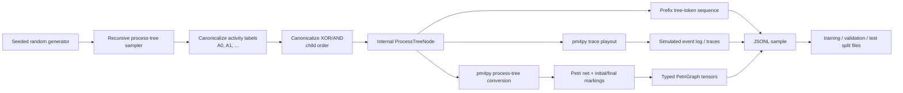
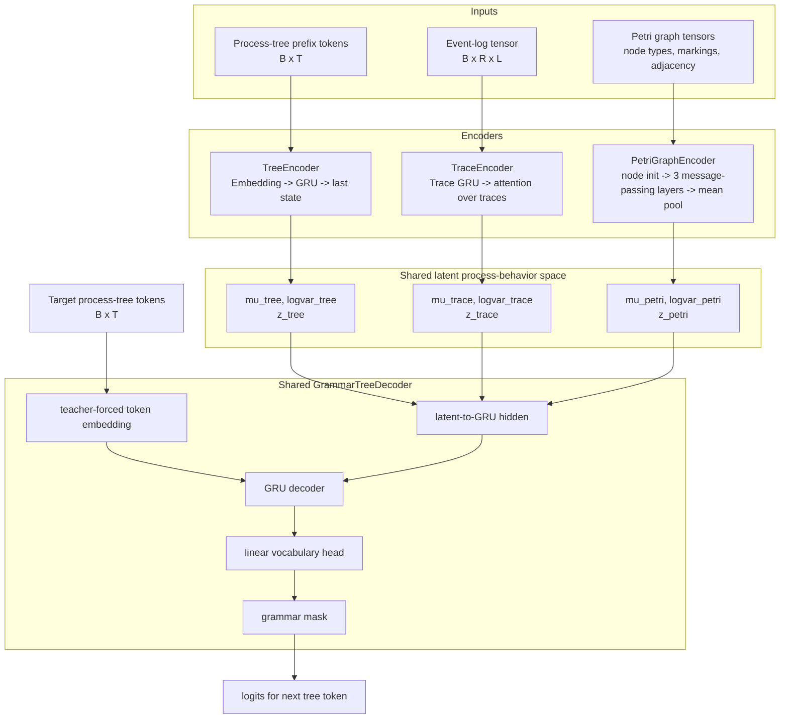

# ProcRosetta: Data Generation, Model Architecture, Training, Checkpointing, and Overfitting Controls

## 1. Scope of this description

This document describes the implementation in the attached `proc-rosetta` project. The archive contains source code and tests, but no precomputed `data/` directory or trained checkpoint. Therefore, the dataset description below refers to the synthetic split generator implemented in the project, not to a concrete already-generated split file.

The system is a first-stage multimodal process-mining model. Each training example is a paired triple of mutually corresponding artifacts:

1. a block-structured **process tree**;
2. an **event log**, represented as a finite collection of simulated traces from that process tree;
3. a **Petri net**, obtained deterministically by converting the same process tree through `pm4py` and then extracting a typed graph representation.

The model learns three encoders, one for each artifact type, that map these modalities into a shared latent process-behavior space. A shared grammar-masked process-tree decoder reconstructs or translates a latent vector back into a valid process-tree token sequence. In the current implementation, generated process trees can then be converted deterministically to Petri nets. The implementation does **not** include a direct arbitrary Petri-net decoder.


### 1.1 Implementation anchors

The main implementation files used for this description are:

| Topic | Source file |
|---|---|
| Process-tree data model and canonicalization | `src/proc_rosetta/tree.py` |
| Synthetic sample generation | `src/proc_rosetta/synthetic.py` |
| `pm4py` conversion, trace simulation, and Petri graph extraction | `src/proc_rosetta/pm4py_bridge.py` |
| Split creation, JSONL reading/writing, and mini-batch collation | `src/proc_rosetta/data.py` |
| Token vocabularies and grammar masks | `src/proc_rosetta/tokenizers.py` |
| Neural encoders, latent projection, decoder, and model forward pass | `src/proc_rosetta/models.py` |
| Multimodal loss function | `src/proc_rosetta/losses.py` |
| Training loop, validation, scheduling, early stopping, and checkpointing | `src/proc_rosetta/training.py` |
| Command-line defaults | `src/proc_rosetta/cli.py` |
| Test-time reports and benchmark metrics | `src/proc_rosetta/benchmarks.py` |

---

## 2. Data generation process

### 2.1 Dataset object: one synthetic paired process sample

A single sample is stored as a `ProcessSample` with four fields:

```text
ProcessSample
├── tree:         ProcessTreeNode
├── traces:       tuple[tuple[str, ...], ...]
├── petri_graph:  PetriGraph
└── equivalence_id: string
```

The `tree`, `traces`, and `petri_graph` are different observations of the same underlying process behavior. During training, all three modalities are therefore treated as positive cross-modal pairs.

A serialized sample in `samples.jsonl` has the following conceptual structure:

```json
{
  "tree": {"kind": "seq", "children": [...]},
  "traces": [["A0", "A1"], ["A0", "A1"]],
  "petri_graph": {
    "node_types": [...],
    "node_names": [...],
    "transition_labels": [...],
    "edges": [[source, target, edge_type], ...],
    "initial_marking": [...],
    "final_marking": [...]
  },
  "equivalence_id": "training-0"
}
```

### 2.2 Synthetic process-tree generation

The process tree is the central generative object. The default synthetic configuration is:

| Parameter | Default | Meaning |
|---|---:|---|
| `max_depth` | 3 | Maximum recursion depth for generated trees. |
| `max_activities` | 30 | Maximum number of distinct activity labels before canonicalization. |
| `max_arity` | 3 | Maximum arity for non-loop operators. |
| `traces_per_sample` | 16 | Number of simulated traces generated from each process tree. |
| `curriculum_phase` | 2 | Operator set used during generation. Phase 2 enables `SEQ`, `XOR`, and `AND`; phase 3 additionally enables `LOOP`. |
| `reuse_activity_probability` | 0.15 | Probability of reusing an activity label instead of introducing a new one. |
| `leaf_probability` | 0.35 | Probability of stopping recursion early and generating a leaf. |

The generator first samples the number of activities uniformly from the range `[2, max_activities]`, then recursively constructs a process tree. At each recursive call, the generator either creates a leaf or creates an operator node:

```text
make_node(depth)
├── if depth >= max_depth: create activity leaf
├── else if random() < leaf_probability: create activity leaf
└── else:
    ├── choose operator from enabled set
    │   ├── default phase 2: SEQ, XOR, AND
    │   └── phase 3: SEQ, XOR, AND, LOOP
    ├── if operator is SEQ/XOR/AND:
    │   ├── sample arity from 2..max_arity
    │   └── recursively generate each child
    └── if operator is LOOP:
        ├── generate body child
        ├── generate redo child
        └── generate exit child, either tau or a generated subtree
```

Activity leaves are initially named `a0`, `a1`, etc. After the tree is generated, activity labels are canonicalized to `A0`, `A1`, ... in order of first occurrence. This makes the synthetic data approximately invariant to arbitrary activity-name choices. If the generated tree contains fewer than two unique activity labels, the code attempts to make the sample less trivial by wrapping the tree in a sequential composition with an additional generated activity leaf. Because the leaf sampler itself can reuse an existing activity label, this is best understood as a heuristic rather than a strict duplicate-label guarantee.

Two structural canonicalizations are important:

1. **Activity-label canonicalization.** Activity labels become `A0`, `A1`, etc., preserving repeated activity identity but removing dependence on the original random names.
2. **Commutative-operator canonicalization.** Children of `XOR` and `AND` nodes are sorted by a canonical structural key. This prevents equivalent child permutations from being represented as distinct target trees.

The supported internal process-tree node kinds are:

```text
ACTIVITY(label)     visible activity leaf
TAU                 silent leaf
SEQ(children)       sequential composition
XOR(children)       exclusive-choice composition
AND(children)       parallel composition
LOOP(children)      loop composition, with two or three children in the data model
```

### 2.3 Petri-net generation from the process tree

For each generated process tree, the implementation calls `pm4py` to convert the process tree into a Petri net with an initial and final marking. The project then converts the `pm4py` Petri-net object into a fixed typed graph representation.

The extracted Petri graph contains:

```text
PetriGraph
├── node_types:          one integer per node
│   ├── 0 = place
│   ├── 1 = visible transition
│   └── 2 = invisible transition
├── node_names:          string names from pm4py
├── transition_labels:   visible transition label or None
├── edges:               (source_index, target_index, edge_type)
│   ├── 0 = place-to-transition arc
│   └── 1 = transition-to-place arc
├── initial_marking:     one scalar per node
└── final_marking:       one scalar per node
```

Places and transitions are sorted by their string names before graph extraction, which makes the graph tensorization deterministic. The neural Petri encoder uses node type, marking vectors, and connectivity. The stored transition labels are preserved in the data object but are not embedded as label features by the current Petri encoder.

### 2.4 Trace/event-log simulation

The event log is simulated from the same generated process tree. The code converts the internal tree to a `pm4py` process tree and uses the `pm4py` process-tree playout algorithm. By default, the playout variant is `topbottom`, and the number of traces is `traces_per_sample`, defaulting to 16.

The event log is then converted into a pure Python trace representation:

```text
trace = [activity_label_1, activity_label_2, ..., activity_label_L]
log   = [trace_1, trace_2, ..., trace_R]
```

Only events containing the `concept:name` attribute are retained. Because the process-tree labels have already been canonicalized, the trace labels are also canonical labels such as `A0`, `A1`, and `A2`.

### 2.5 Split generation: training, validation, and test

The root script `sample.py` recreates a local dataset with three held-out splits:

```text
data/
├── metadata.json
├── training/
│   └── samples.jsonl
├── validation/
│   └── samples.jsonl
└── test/
    └── samples.jsonl
```

The default split sizes are:

| Split | Default count | Role |
|---|---:|---|
| `training` | 2000 | Used to update neural-network weights. Shuffled during training. |
| `validation` | 256 | Used after each epoch for model selection, learning-rate scheduling, and early stopping. Not shuffled. |
| `test` | 256 | Used only after training/checkpoint selection for final evaluation. Not used for optimization or early stopping. |

The split generator removes any existing `data/` directory and then generates fresh samples for all three splits. A single seeded Python random-number generator controls the process-tree sampler; the default seed is 13. The code does not expose a separate seed for the `pm4py` trace playout call, so exact trace-level reproducibility may also depend on the behavior of the installed `pm4py` version and its internal randomness. Each generated sample receives an `equivalence_id` of the form `training-0`, `validation-0`, or `test-0` depending on the split. The code does not explicitly deduplicate process trees across splits; it relies on independent random generation and held-out split files.

The `metadata.json` file records the random seed, the synthetic generation configuration, the relative path of each split file, and descriptive statistics for each split. These statistics include sample count, average tree size, average tree depth, average trace count, average trace length, maximum Petri-node count, and maximum Petri-edge count.

### 2.6 Batch construction and tensorization

Training reads the persisted JSONL files and collates a mini-batch of `ProcessSample` objects into tensors. Let:

```text
B = mini-batch size
T = number of process-tree tokens after padding/truncation
R = number of traces per sample after padding/truncation
L = trace length after padding/truncation
N = number of Petri graph nodes after padding/truncation
V_tree = process-tree vocabulary size
V_act = activity vocabulary size
```

The default collation limits are:

| Batch limit | Default |
|---|---:|
| `max_tree_tokens` | 128 |
| `max_traces` | 32 |
| `max_trace_length` | 64 |
| `max_petri_nodes` | 128 |

Each mini-batch contains:

```text
batch
├── tree_tokens: LongTensor[B, T]
│   └── prefix-tokenized process tree, padded with <pad>
├── traces
│   ├── tokens:  LongTensor[B, R, L]
│   ├── lengths: LongTensor[B, R]
│   └── mask:    BoolTensor[B, R]
├── petri
│   ├── node_types: LongTensor[B, N]
│   ├── node_mask:  BoolTensor[B, N]
│   ├── markings:   FloatTensor[B, N, 2]
│   └── adjacency:  FloatTensor[B, 2, N, N]
└── samples: original Python ProcessSample objects
```

The `tree_tokens` sequence uses a prefix notation:

```text
<bos>, NODE, [ARITY_k, CHILD_1, ..., CHILD_k if NODE is an operator], <eos>, <pad>, ...
```

For example, a process tree `SEQ(A0, XOR(A1, A2))` is encoded conceptually as:

```text
<bos> SEQ ARITY_2 A0 XOR ARITY_2 A1 A2 <eos>
```

The activity-tokenizer used for traces contains only `<pad>` and the canonical activity tokens `A0`, ..., `A(max_activities-1)`. It does not add trace-level beginning-of-sequence or end-of-sequence tokens.

### 2.7 Data-generation flow diagram



---

## 3. Model architecture

### 3.1 High-level architecture

ProcRosetta has three modality-specific encoders and one shared process-tree decoder:

```text
process-tree tokens  -> TreeEncoder       -> q_tree(z | tree)  -> z_tree  --.
trace-log tensors    -> TraceEncoder      -> q_trace(z | log)  -> z_trace --+--> GrammarTreeDecoder -> process-tree tokens
Petri-graph tensors  -> PetriGraphEncoder -> q_petri(z | net)  -> z_petri --'
```

All encoders project their inputs to a diagonal Gaussian latent distribution in the same latent space:

```math
q_m(z \mid x_m) = \mathcal{N}(\mu_m, \operatorname{diag}(\exp(\log \sigma^2_m)))
```

where `m` is one of `tree`, `trace`, or `petri`. During training, the latent vector is sampled with the reparameterization form:

```math
z_m = \mu_m + \epsilon \odot \exp(0.5 \log \sigma^2_m), \quad \epsilon \sim \mathcal{N}(0, I).
```

During validation and testing, deterministic inference uses `z_m = mu_m`.

The default architectural hyperparameters used by `train.py` are:

| Hyperparameter | Default |
|---|---:|
| latent dimension `D_z` | 64 |
| hidden dimension `H` | 128 |
| dropout probability | 0.15 |
| Petri message-passing steps | 3 |

With the default synthetic data configuration, the tree vocabulary has 40 tokens:

```text
<pad>, <bos>, <eos>, TAU,
SEQ, XOR, AND, LOOP,
ARITY_2, ARITY_3,
A0, A1, ..., A29
```

The activity vocabulary for traces has 31 tokens:

```text
<pad>, A0, A1, ..., A29
```

If `max_activities` or `max_arity` are changed, these vocabularies expand accordingly.

### 3.2 Shared latent projection block

Each encoder ends with the same latent projection block:

```text
features h in R^H
├── Linear(H -> D_z) -> mu
└── Linear(H -> D_z) -> logvar, clamped to [-8, 8]
```

The clamp on `logvar` prevents numerically extreme latent variances. The resulting `LatentDistribution` object is used both for stochastic sampling and for the KL regularization term in the loss.

### 3.3 Tree encoder

**Input.** A padded process-tree token matrix:

```text
tree_tokens: LongTensor[B, T]
```

**Computation.**

```text
tree_tokens
  -> token embedding: Embedding(V_tree, H), padding_idx=<pad>
  -> dropout
  -> one-layer GRU, hidden size H, batch_first=True
  -> select final non-padding output for each sequence
  -> dropout
  -> latent projection: Linear(H -> D_z) for mu and logvar
```

The final tree representation is the GRU output at the last non-padding token, which normally corresponds to `<eos>` unless the sequence was truncated. This vector is projected to `mu_tree` and `logvar_tree`.

**Illustration detail.** In a figure, this encoder can be drawn as a single sequence encoder: token boxes feed an embedding layer, then a unidirectional GRU chain, then a selector arrow from the last non-pad state into two parallel linear heads labeled `mu_tree` and `logvar_tree`.

### 3.4 Trace encoder

**Input.** A batch of event logs, where each sample contains multiple traces:

```text
traces.tokens:  LongTensor[B, R, L]
traces.lengths: LongTensor[B, R]
traces.mask:    BoolTensor[B, R]
```

**Computation.**

```text
[B, R, L] trace-token tensor
  -> reshape to [B * R, L]
  -> activity embedding: Embedding(V_act, H), padding_idx=<pad>
  -> dropout
  -> one-layer GRU, hidden size H
  -> select final hidden state of each trace using trace length
  -> reshape to [B, R, H]
  -> apply trace mask
  -> attention score for each trace: Linear(H -> 1)
  -> masked softmax over traces R
  -> weighted sum of trace vectors
  -> dropout
  -> latent projection: Linear(H -> D_z) for mu and logvar
```

This encoder is hierarchical. First, each individual trace is encoded by a GRU. Then, the event log is encoded by an attention-weighted pooling over trace-level vectors.

**Illustration detail.** Draw this as two levels. At the lower level, each trace has its own token sequence and GRU. At the upper level, the final trace vectors enter an attention pooling module. Invalid padded traces are masked before softmax. The pooled log vector then branches into `mu_trace` and `logvar_trace`.

### 3.5 Petri graph encoder

**Input.** A padded typed Petri graph:

```text
petri.node_types: LongTensor[B, N]
petri.markings:   FloatTensor[B, N, 2]
petri.node_mask:  BoolTensor[B, N]
petri.adjacency:  FloatTensor[B, 2, N, N]
```

The two channels of `adjacency` correspond to place-to-transition and transition-to-place arcs. Before message passing, the implementation collapses these edge-type channels into a single binary adjacency matrix:

```math
A = \min(1, A_{place\to transition} + A_{transition\to place}).
```

**Initial node representation.** For each node `i`, the initial hidden vector is:

```math
h_i^{(0)} = \operatorname{Embedding}(node\_type_i) + W_m \cdot marking_i,
```

where `marking_i` is a two-dimensional vector containing the initial-marking and final-marking values for that node. Dropout and node masking are applied after this initialization.

**Message passing.** The encoder performs three message-passing layers by default. At each layer `s`, it computes incoming, outgoing, and self contributions:

```math
incoming_i^{(s)} = \sum_j A_{j,i} W_{in}^{(s)} h_j^{(s)}
```

```math
outgoing_i^{(s)} = \sum_j A_{i,j} W_{out}^{(s)} h_j^{(s)}
```

```math
updated_i^{(s)} = W_{self}^{(s)} h_i^{(s)} + incoming_i^{(s)} + outgoing_i^{(s)}.
```

The update then applies ReLU, layer normalization, dropout, and node masking:

```math
h_i^{(s+1)} = mask_i \cdot \operatorname{Dropout}(\operatorname{LayerNorm}(\operatorname{ReLU}(updated_i^{(s)}))).
```

**Graph pooling.** After message passing, node vectors are mean-pooled over non-padding nodes:

```math
h_{graph} = \frac{1}{\sum_i mask_i} \sum_i mask_i h_i.
```

The graph vector is passed through dropout and then through the latent projection block to produce `mu_petri` and `logvar_petri`.

**Illustration detail.** Draw Petri nodes as typed circles/squares with an additional two-number marking feature. Show three stacked message-passing blocks, each with self, incoming, and outgoing arrows. Then show masked mean pooling into `mu_petri` and `logvar_petri`.

### 3.6 Grammar-masked process-tree decoder

The decoder is shared across all three source modalities.

**Inputs.**

```text
z:            FloatTensor[B, D_z]
decoder_input: LongTensor[B, T - 1]
```

During training, `decoder_input` is the ground-truth process-tree token sequence shifted right:

```text
decoder_input = tree_tokens[:, :-1]
targets       = tree_tokens[:, 1:]
```

This is teacher forcing: at position `t`, the decoder receives the correct previous tokens and predicts the next token.

**Computation.**

```text
latent z
  -> Linear(D_z -> H)
  -> tanh
  -> initial hidden state of one-layer GRU

decoder_input tokens
  -> Embedding(V_tree, H), padding_idx=<pad>
  -> dropout
  -> GRU initialized by latent-derived hidden state
  -> dropout
  -> Linear(H -> V_tree)
  -> grammar mask: invalid next-token logits set to -1e9
  -> logits over tree vocabulary
```

The decoder output has shape:

```text
logits: FloatTensor[B, T - 1, V_tree]
```

### 3.7 Grammar mask

The decoder does not freely predict any token at every position. A hand-coded prefix grammar determines the valid next tokens from the already-generated prefix.

The grammar state tracks three values:

```text
state:            NEED_NODE, NEED_ARITY, DONE, or INVALID
pending_operator: operator token waiting for its arity token, if any
open_nodes:       number of tree-node slots that still need to be filled
```

Conceptually:

1. A valid tree sequence begins with `<bos>` and starts with one open node slot.
2. If the decoder emits an activity token or `TAU`, one open node slot is consumed.
3. If the decoder emits an operator token such as `SEQ`, `XOR`, `AND`, or `LOOP`, one open node slot is consumed and the next token must be an arity token.
4. If an arity token `ARITY_k` is emitted, `k` new child node slots are opened.
5. When `open_nodes = 0`, the only valid next structural token is `<eos>`.
6. After `<eos>`, the only valid token is `<pad>`.

For `LOOP`, the mask restricts the arity to the loop-compatible arity used by the tokenizer. Under the default tokenizer, this is `ARITY_3`.

Invalid logits are set to approximately negative infinity (`-1e9`) before the cross-entropy is computed. Therefore, the model is trained only over syntactically admissible next tokens.

### 3.8 Full forward pass

For each batch, the model performs:

```text
1. Encode each modality:
   tree_tokens -> q_tree(z | tree)
   traces      -> q_trace(z | log)
   petri       -> q_petri(z | net)

2. Sample or select latent vectors:
   training:        z_m = mu_m + epsilon * sigma_m
   validation/test: z_m = mu_m

3. Decode every latent source into the same target tree:
   z_tree  -> GrammarTreeDecoder -> logits_tree_to_tree
   z_trace -> GrammarTreeDecoder -> logits_trace_to_tree
   z_petri -> GrammarTreeDecoder -> logits_petri_to_tree

4. Return:
   dists       = {tree, trace, petri latent distributions}
   z           = {tree, trace, petri latent vectors}
   tree_logits = {tree, trace, petri decoder logits}
```

The architecture can therefore be illustrated as three arrows into a shared latent space and three arrows from that shared latent space through one decoder to a common process-tree target.

### 3.9 Architecture diagram blueprint



---

## 4. Training process

### 4.1 What an epoch is

An epoch is one complete pass over the training split. With the default configuration, one epoch processes 2000 training samples in shuffled mini-batches of size 32. Because the final batch is not dropped, the default number of training mini-batches per epoch is:

```math
\lceil 2000 / 32 \rceil = 63.
```

After this training pass, the model is evaluated once on the full validation split. Validation uses the same loss function but does not update model parameters.

### 4.2 What is provided at each training step

At each optimization step, the model receives one mini-batch containing all three modalities for the same set of samples:

```text
mini-batch step input
├── ground-truth tree token sequence
├── simulated event-log traces from the same tree
├── Petri graph converted from the same tree
└── original sample objects, used only for bookkeeping/evaluation
```

The same ground-truth tree token sequence is used as the target for three decoder pathways:

```text
tree latent  -> target tree   reconstruction
trace latent -> target tree   cross-modal translation
Petri latent -> target tree   cross-modal translation
```

This means that every training step simultaneously teaches the model:

1. to autoencode the process tree through the tree encoder;
2. to translate event-log behavior into the corresponding process tree;
3. to translate Petri-net structure into the corresponding process tree;
4. to align the three latent representations of the same process.

### 4.3 One training step in detail

For each mini-batch, the training loop performs:

```text
1. Move all tensor fields to the configured device.
2. Set gradients to zero.
3. Run the model in training mode.
   ├── dropout is active
   └── latent vectors are sampled stochastically
4. Compute the multimodal tree loss.
5. Backpropagate the total loss.
6. Clip the global gradient norm to 5.0.
7. Apply an AdamW optimizer step.
8. Accumulate scalar metrics for epoch-level reporting.
```

The default optimizer is AdamW with:

| Optimizer parameter | Default |
|---|---:|
| learning rate | `1e-3` |
| weight decay | `1e-4` |

### 4.4 Validation step

After each epoch, validation is performed over the entire validation split:

```text
1. Switch model to evaluation mode.
   ├── dropout is disabled
   └── no gradients are recorded
2. Use deterministic latent vectors z = mu.
3. Compute the same loss components as during training.
4. Average validation metrics across validation mini-batches.
5. Use validation loss for learning-rate scheduling, best-checkpoint selection, and early stopping.
```

The validation data are not shuffled. The validation split is never used in `optimizer.step()`.

---

## 5. Training loss in detail

### 5.1 Notation

Let the three modalities be:

```text
M = {tree, trace, petri}
```

For a mini-batch of size `B`, let the ground-truth tree sequence be:

```text
x = [x_0, x_1, ..., x_{T-1}]
```

where `x_0 = <bos>` and the sequence ends with `<eos>` followed by `<pad>` tokens. The decoder input is:

```math
x_{input} = [x_0, ..., x_{T-2}],
```

and the prediction target is:

```math
y = [x_1, ..., x_{T-1}].
```

For modality `m`, the decoder produces logits:

```math
\ell_m = decoder(z_m, x_{input}).
```

### 5.2 Grammar-masked sequence cross-entropy

The reconstruction and translation terms use a sequence cross-entropy over non-padding target positions. Before cross-entropy, grammar-invalid next-token logits have already been set to `-1e9`. Therefore, invalid grammar tokens do not receive probability mass in practice.

With label smoothing coefficient `epsilon`, default `0.05`, the per-token loss is:

```math
\mathcal{L}_{CE}(t)
= (1 - \epsilon)(-\log p(y_t))
+ \epsilon \left(-\frac{1}{|G_t|} \sum_{v \in G_t} \log p(v)\right),
```

where:

```text
G_t = set of grammar-valid next tokens at position t
p(v) = softmax probability assigned to token v
```

Padding targets are ignored. If label smoothing is disabled, this reduces to the standard cross-entropy over non-padding target positions.

### 5.3 Tree reconstruction and cross-modal translation terms

The model computes three tree-generation losses:

```math
\mathcal{L}_{tree\to tree}
= CE(decoder(z_{tree}, x_{input}), y)
```

```math
\mathcal{L}_{trace\to tree}
= CE(decoder(z_{trace}, x_{input}), y)
```

```math
\mathcal{L}_{petri\to tree}
= CE(decoder(z_{petri}, x_{input}), y).
```

The first term is an autoencoding/reconstruction loss. The second and third terms are cross-modal translation losses: they require the trace encoder and Petri encoder to produce latent codes that the shared tree decoder can use to recover the process tree.

### 5.4 Latent mean-alignment loss

The model also penalizes disagreement between the latent means of corresponding modalities. For all unordered modality pairs, the loss is the mean squared error between latent means:

```math
\mathcal{L}_{align}
= \frac{1}{3}
\left(
\|\mu_{tree} - \mu_{trace}\|_2^2
+ \|\mu_{tree} - \mu_{petri}\|_2^2
+ \|\mu_{trace} - \mu_{petri}\|_2^2
\right).
```

This encourages all three encoders to represent equivalent process behavior near the same location in latent space.

### 5.5 Cross-modal contrastive loss

A symmetric contrastive loss is computed for every modality pair. For one ordered pair, latent means are L2-normalized and compared by dot product. With temperature `tau = 0.2`, the similarity matrix is:

```math
S_{ij} = \frac{\operatorname{normalize}(\mu_i^{left})^T
\operatorname{normalize}(\mu_j^{right})}{\tau}.
```

The positive example for row `i` is the same process sample in the other modality, i.e., column `i`. Other samples in the same mini-batch serve as negatives. The loss is symmetric:

```math
\mathcal{L}_{contrastive}^{left,right}
= \frac{1}{2}
\left(
CE(S, labels) + CE(S^T, labels)
\right),
```

where `labels = [0, 1, ..., B-1]`. The final contrastive term averages this over the three modality pairs: tree-trace, tree-Petri, and trace-Petri.

This term improves instance-level cross-modal retrieval pressure: the latent vector of a trace log should be closest to the latent vector of its corresponding tree and Petri net rather than to other processes in the mini-batch.

### 5.6 KL regularization

Each encoder outputs a diagonal Gaussian distribution. The KL term penalizes deviation from a standard normal prior:

```math
\mathcal{L}_{KL}
= \frac{1}{3} \sum_{m \in M}
\mathbb{E}_{batch}
\left[
-\frac{1}{2} \sum_d
\left(1 + \log \sigma_{m,d}^2 - \mu_{m,d}^2 - \sigma_{m,d}^2\right)
\right].
```

The KL coefficient is small by default, so the term acts as a weak regularizer rather than dominating the reconstruction and translation objectives.

### 5.7 Total loss

The total loss is a weighted sum:

```math
\begin{aligned}
\mathcal{L}_{total}
=&\; 1.0 \cdot \mathcal{L}_{tree\to tree}
 + 1.0 \cdot \mathcal{L}_{trace\to tree}
 + 1.0 \cdot \mathcal{L}_{petri\to tree} \\
&+ 0.1 \cdot \mathcal{L}_{align}
 + 0.1 \cdot \mathcal{L}_{contrastive}
 + 0.001 \cdot \mathcal{L}_{KL}.
\end{aligned}
```

The default loss-weight table is:

| Component | Default weight |
|---|---:|
| tree reconstruction | 1.0 |
| trace-to-tree translation | 1.0 |
| Petri-to-tree translation | 1.0 |
| latent alignment | 0.1 |
| contrastive alignment | 0.1 |
| KL regularization | 0.001 |
| label smoothing | 0.05 |

Only the weighted sum is backpropagated. The individual components are detached and reported as metrics.

---

## 6. Checkpointing and training history

### 6.1 Latest and best checkpoints

Training saves two checkpoint types:

```text
checkpoints/proc_rosetta.pt       latest completed epoch
checkpoints/proc_rosetta.best.pt  best validation-loss epoch
```

The exact file names depend on the `--checkpoint` argument. If the checkpoint path is:

```text
checkpoints/model.pt
```

then the best checkpoint path is:

```text
checkpoints/model.best.pt
```

The latest checkpoint is written after every completed epoch. The best checkpoint is written only when the current validation loss improves over the previous best validation loss by at least `min_delta`, default `0.001`.

### 6.2 Checkpoint contents

Each checkpoint stores:

```text
checkpoint
├── version
├── epoch
├── model_state_dict
├── train_config
├── synthetic_config
├── history
├── best_validation_loss
└── is_best
```

The `model_state_dict` contains the neural-network parameters. The training and synthetic configuration entries allow the model architecture and tokenizers to be reconstructed when loading the checkpoint. The history stores per-epoch training and validation metrics accumulated so far.

### 6.3 Per-epoch metrics CSV

At the beginning of a training run, the metrics CSV is recreated. The default path is:

```text
checkpoints/training_metrics.csv
```

After every epoch, one row is appended. The row contains:

```text
epoch
learning_rate
epoch_seconds
best_validation_loss
is_best
epochs_without_improvement
training_loss, training_tree_reconstruction, ...
validation_loss, validation_tree_reconstruction, ...
gap_loss, gap_tree_reconstruction, ...
```

The generalization gap for a metric is:

```math
gap = validation\_metric - training\_metric.
```

A large positive validation-training loss gap is a warning sign of overfitting.

### 6.4 Learning-rate scheduling

The training loop uses `ReduceLROnPlateau` on validation loss. The defaults are:

| Scheduler parameter | Default |
|---|---:|
| monitored metric | validation loss |
| mode | minimize |
| patience | 2 epochs |
| reduction factor | 0.5 |
| minimum learning rate | `1e-5` |

If validation loss plateaus, the learning rate is multiplied by 0.5 until the minimum learning rate is reached.

### 6.5 Early stopping

Early stopping also monitors validation loss. A validation improvement is accepted only if:

```math
validation\_loss < best\_validation\_loss - min\_delta.
```

The default `min_delta` is `0.001`. If no such improvement occurs for `early_stopping_patience = 5` consecutive epochs, training stops. The latest and best checkpoints have already been saved before the stopping check is applied.

---

## 7. Prevention of overfitting

The implementation includes several overfitting controls. They act at different levels of the pipeline.

| Mechanism | Where it acts | Effect |
|---|---|---|
| Held-out validation and test splits | Data protocol | Validation is used for model selection and early stopping; test is reserved for final evaluation. |
| Training-shuffle only | Data loader | The training split is shuffled; validation is kept deterministic. |
| Dropout, default 0.15 | Tree encoder, trace encoder, Petri encoder, decoder | Reduces co-adaptation of hidden units and makes the stochastic training forward pass noisier. |
| AdamW weight decay, default `1e-4` | Optimizer | Penalizes large weights independently of the adaptive gradient update. |
| Label smoothing, default 0.05 | Tree-token cross-entropy | Prevents the decoder from becoming overconfident on the exact target token while still respecting grammar-valid tokens. |
| KL regularization, weight 0.001 | Latent distributions | Encourages bounded, approximately normal latent codes. |
| Stochastic latent sampling | Training forward pass | Adds latent noise during training; validation uses deterministic means. |
| Latent mean alignment | Shared latent space | Forces equivalent modalities to agree, reducing the chance that one encoder memorizes modality-specific artifacts unrelated to behavior. |
| Cross-modal contrastive loss | Shared latent space | Uses other mini-batch samples as negatives and encourages paired modalities to be closer than unrelated processes. |
| Grammar masking | Decoder output space | Removes invalid process-tree continuations from the hypothesis space. |
| Validation-loss LR scheduling | Optimizer | Reduces learning rate when validation improvement stalls. |
| Early stopping | Training loop | Stops training when validation loss no longer improves. |
| Best-checkpoint retention | Checkpointing | Preserves the model from the best validation epoch even if later epochs overfit. |
| Canonicalized labels and commutative child order | Data representation | Reduces memorization of arbitrary label names and equivalent XOR/AND child permutations. |

Important limitation: the split generator does not explicitly remove duplicate or behaviorally equivalent process trees across the training, validation, and test files. For a formal experimental study, it would be prudent to quantify duplicate or near-duplicate rates across splits, especially if using small datasets or shallow generation settings.

---

## 8. Test-time evaluation protocol

The test script loads a checkpoint and evaluates the persisted test split. The default checkpoint path is the latest checkpoint, not automatically the best checkpoint. To evaluate the best-validation model, the best checkpoint path should be passed explicitly.

The test report includes several groups of metrics:

1. **Neural test losses.** The same loss components used during validation are computed on the test split.
2. **Decode quality.** The decoder greedily decodes process trees from four latent sources: `tree_mu`, `trace_mu`, `petri_mu`, and the mean-fused latent vector. The decoded tree is checked for termination, grammar-valid decoding, exact tree match, Petri-net convertibility, token edit distance, and behavioral distance after simulating traces from the decoded tree.
3. **Process-discovery quality.** For each test log, the trace encoder and shared decoder produce a ProcRosetta process tree, which is converted to a Petri net. The same log is also given to PM4Py's Inductive Miner baseline. Both resulting models are scored against the log with alignment-based fitness, alignment-based precision, and their harmonic-mean F1 score.
4. **Behavioral distance scale.** Test logs are compared pairwise using trace-variant L1, directly-follows L1, trace-length L1, and their mean.
5. **Cross-modal retrieval.** The system measures whether a latent vector from one modality retrieves the corresponding sample in another modality.
6. **Embedding comparisons.** Learned ProcRosetta embeddings are compared against deterministic event-log features, deterministic Petri structural features, and, when available, a `pm4py` Petri-net Node2Vec/Word2Vec embedding baseline.

The learned fused embedding used in benchmark comparisons is:

```math
\mu_{fused} = \frac{1}{3}(\mu_{tree} + \mu_{trace} + \mu_{petri}).
```

---

## 9. Suggested scientific illustrations

### Figure A: Synthetic sample generation

Show one process tree as the root object. From it, draw two deterministic/simulation branches:

```text
Process tree
├── pm4py conversion -> Petri net -> typed PetriGraph
└── pm4py playout    -> event log / traces
```

Annotate that all three artifacts share the same `equivalence_id` and become one paired training sample.

### Figure B: Batch tensorization

Draw a mini-batch as four parallel tensor blocks:

```text
tree_tokens: [B, T]
trace tokens + lengths + mask: [B, R, L], [B, R], [B, R]
Petri node tensors: [B, N], [B, N, 2], [B, 2, N, N]
target tree tokens: shifted version of tree_tokens
```

Highlight that the tree token sequence supplies both the tree encoder input and the decoder teacher-forcing target.

### Figure C: Multimodal architecture

Use three colored encoder branches, all ending in Gaussian latent heads:

```text
TreeEncoder       -> mu_tree, logvar_tree
TraceEncoder      -> mu_trace, logvar_trace
PetriGraphEncoder -> mu_petri, logvar_petri
```

Then show a shared decoder box reused three times:

```text
z_tree  -> shared decoder -> tree logits
z_trace -> shared decoder -> tree logits
z_petri -> shared decoder -> tree logits
```

Add a side annotation showing latent-alignment and contrastive losses between the three `mu` vectors.

### Figure D: Decoder grammar mask

Draw the decoder as an autoregressive GRU initialized by `z`. At each output step, show:

```text
raw logits -> grammar mask -> valid-token logits -> softmax / cross-entropy
```

Include a small grammar-state panel with `open_nodes` and `pending_operator`.

### Figure E: Training/checkpoint timeline

Draw an epoch timeline:

```text
shuffle training split
-> mini-batch updates
-> validation pass
-> scheduler step
-> update best validation loss
-> save latest checkpoint
-> maybe save best checkpoint
-> append CSV row
-> maybe early stop
```

This figure makes clear that the test split is outside the training loop.

---

## 10. Concise methods-style summary

Synthetic paired process-mining samples are generated from randomly sampled block-structured process trees. Each tree is canonicalized, converted to a Petri net using `pm4py`, and simulated to produce a fixed number of traces. The resulting process tree, event log, and Petri graph are serialized as aligned triples and split into training, validation, and test files. The default split sizes are 2000, 256, and 256 samples.

The model contains three modality-specific encoders: a GRU tree encoder, a hierarchical GRU-plus-attention trace encoder, and a message-passing Petri graph encoder. Each encoder outputs a diagonal Gaussian latent distribution in a shared latent space. A shared GRU decoder, initialized from a sampled or deterministic latent vector, predicts prefix-encoded process-tree tokens under a hand-coded grammar mask.

Training uses teacher forcing and optimizes three grammar-masked sequence losses: tree-to-tree reconstruction, trace-to-tree translation, and Petri-to-tree translation. These are augmented with latent mean alignment, a symmetric cross-modal contrastive objective, and weak KL regularization. Optimization uses AdamW, dropout, label smoothing, gradient clipping, validation-based learning-rate reduction, best-checkpoint retention, and early stopping. The validation split controls learning-rate scheduling and stopping; the test split is reserved for final loss, decoding, discovery-quality comparison against Inductive Miner, retrieval, and embedding-quality evaluation.
